# OpenClaw on DigitalOcean

Install OpenClaw on a fresh DigitalOcean droplet in a few commands.
Connect to the UI from your local browser via SSH tunnel — no domain or open ports needed.

---

## Requirements

- Ubuntu 22.04 or 24.04 droplet (1 GB RAM minimum, 2 GB recommended)
- Root or sudo access
- A Telegram bot token — get one from [@BotFather](https://t.me/BotFather)
- An API key for OpenAI or Anthropic (or a ChatGPT/Claude subscription for OAuth)

---

## Step 1 — Create a droplet

Go to [cloud.digitalocean.com](https://cloud.digitalocean.com) → **Create → Droplets**.

**OS and size** — select Ubuntu 24.04 (LTS) x64, Basic plan, Regular SSD, $18/mo (2 vCPU / 2 GB RAM / 60 GB SSD):


**Region** — pick the datacenter closest to you or your users (optional, any region works):


**Authentication** — select **SSH Key** and choose an existing key, or click **New SSH Key** to add one:


> If you don't have an SSH key yet, run `ssh-keygen -t ed25519` in your terminal (works on macOS, Linux, and Windows 10/11 PowerShell), then paste the contents of the `.pub` file here.
> Alternatively, follow [GitHub's guide](https://docs.github.com/en/authentication/connecting-to-github-with-ssh/generating-a-new-ssh-key-and-adding-it-to-the-ssh-agent).

Leave all other settings as default. Click **Create Droplet** and wait ~30 seconds.

Once created, copy the droplet's **IPv4 address** from the dashboard.

---

## Step 2 — Connect via SSH

### macOS / Linux

Open a terminal and run:

```bash
ssh -i ~/.ssh/YOUR_KEY_NAME root@YOUR_DROPLET_IP
```

Replace `YOUR_KEY_NAME` with the filename of your private key (e.g. `openclaw-vps`, `id_ed25519`, `id_rsa`).
Your keys are in `~/.ssh/` — run `ls ~/.ssh/` if unsure.

> **Tip — skip the `-i` flag:** add an entry to `~/.ssh/config` so the key is picked up automatically:
> ```
> Host YOUR_DROPLET_IP
>     User root
>     IdentityFile ~/.ssh/YOUR_KEY_NAME
> ```
> After that, `ssh root@YOUR_DROPLET_IP` works without `-i`.

### Windows 10 / 11

OpenSSH is built into Windows. Open **PowerShell** or **Command Prompt** and run:

```powershell
ssh -i $env:USERPROFILE\.ssh\YOUR_KEY_NAME root@YOUR_DROPLET_IP
```

Your keys are in `C:\Users\YourName\.ssh\` — run `dir $env:USERPROFILE\.ssh\` if unsure.

> **Tip — SSH config on Windows** works the same way. Create or edit `C:\Users\YourName\.ssh\config`:
> ```
> Host YOUR_DROPLET_IP
>     User root
>     IdentityFile ~/.ssh/YOUR_KEY_NAME
> ```
> After that, `ssh root@YOUR_DROPLET_IP` works without `-i`.

**Prefer a GUI?** Use **PuTTY** — enter the droplet IP as the host, go to **Connection → SSH → Auth → Credentials** and select your private key. PuTTY uses `.ppk` format — convert with **PuTTYgen** if needed.

---

If you used **password** authentication instead of SSH key, omit `-i` — you'll be prompted for the password.

You should see the Ubuntu welcome message.

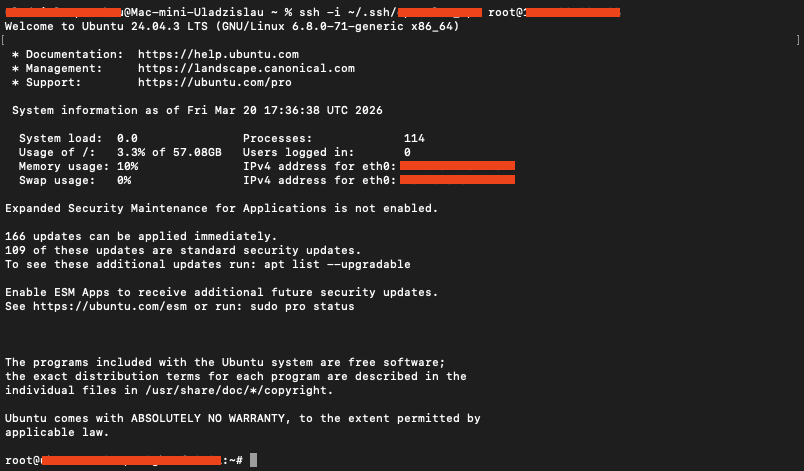

---

## Step 3 — Run the installer

Paste this single command and press Enter:

```bash
bash <(curl -fsSL https://raw.githubusercontent.com/no-name-labs/openclaw-install-scripts/main/vps/digitalocean/install.sh)
```

The installer runs 5 stages automatically:

| Stage | What happens |
|---|---|
| 1/5 | Installs system packages and Node.js |
| 2/5 | Installs OpenClaw via npm, starts the gateway |
| 3/5 | You choose your LLM provider and enter your API key |
| 4/5 | You enter your Telegram bot token, pair the bot, choose binding target |
| 5/5 | Startup cron installed, summary printed with gateway token |

### LLM provider menu

When prompted, use ↑/↓ to select your provider and auth method, then press Enter.

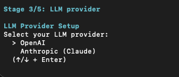

**If you choose OAuth (Codex or Anthropic setup-token):** the installer will open a browser URL for you to authenticate. On a VPS, it prints the URL — open it on your local machine, complete the login, then paste the redirect URL back into the terminal:

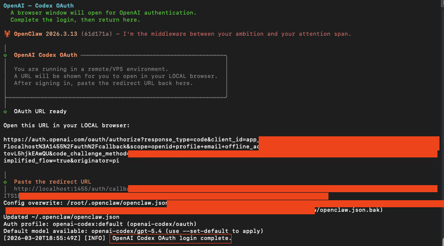

### Telegram pairing

When the installer reaches Stage 4, it asks for your bot token:

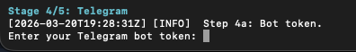

After that it enables the plugin and waits for you to pair:

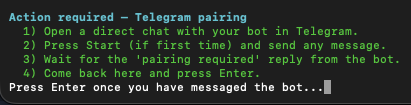

Steps:

1. Open Telegram and find your bot (search for its username).
2. Press **Start** if you haven't chatted with it before.
3. Send any message — the bot replies with a pairing code.
4. Return to the terminal and press **Enter** to approve.

### Binding target

After pairing, the installer asks where the bot should reply:

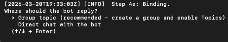

- **Group topic** — the bot listens to a specific topic inside a Telegram group (recommended for teams). You'll paste a topic link, e.g. `https://t.me/c/1234567890/2`.
- **Direct chat** — the bot replies directly in a 1-on-1 chat with you. Simplest option for solo use.

### Result

Once pairing and binding are complete, the bot confirms access and responds immediately:

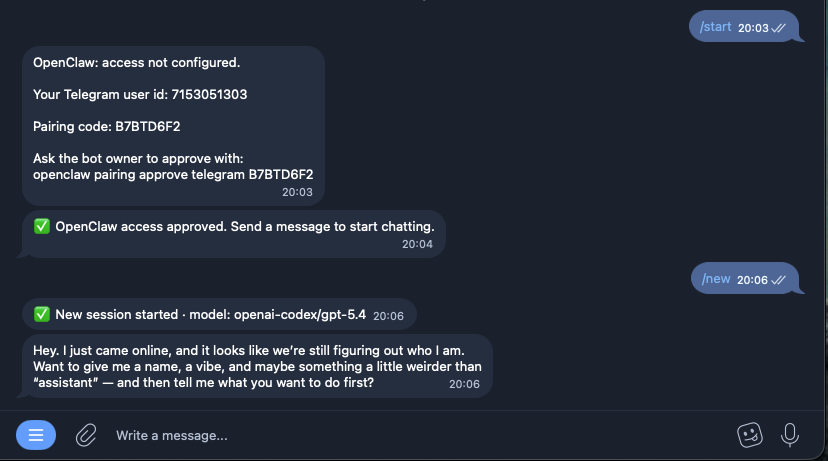

### Install summary

At the end the installer prints a summary including your gateway token.
**Copy and save the gateway token** — you'll need it to connect to the UI in the next step.

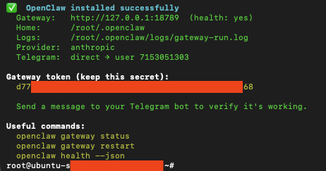

---

## Step 4 — Open the UI in your browser (SSH tunnel)

OpenClaw's UI runs on the droplet at `localhost:18789`.
An SSH tunnel forwards that port to your local machine — no domain or firewall changes needed.

### macOS / Linux

Open a **new terminal tab** (keep the droplet SSH session open) and run:

```bash
ssh -i ~/.ssh/YOUR_KEY_NAME -L 18789:127.0.0.1:18789 root@YOUR_DROPLET_IP -N
```

The command will appear to hang — that's correct, the tunnel is running.

> **Port already in use?** If you see `bind: Address already in use`, just pick any other local port — only the left side changes:
> ```bash
> ssh -i ~/.ssh/YOUR_KEY_NAME -L 18790:127.0.0.1:18789 root@YOUR_DROPLET_IP -N
> ```
> Then open `http://localhost:18790` instead.

> **Tip — persistent tunnel via SSH config:**
> Add this to `~/.ssh/config` to skip the `-i` flag entirely:
> ```
> Host openclaw-vps
>     HostName YOUR_DROPLET_IP
>     User root
>     IdentityFile ~/.ssh/YOUR_KEY_NAME
>     LocalForward 18789 127.0.0.1:18789
> ```
> Then run `ssh openclaw-vps -N` and access `http://localhost:18789`.

### Windows 10 / 11

Open a **new PowerShell or Command Prompt window** and run the same command:

```powershell
ssh -i $env:USERPROFILE\.ssh\YOUR_KEY_NAME -L 18789:127.0.0.1:18789 root@YOUR_DROPLET_IP -N
```

The window will appear to hang — that's correct, the tunnel is running. Keep it open.

> **Tip — SSH config on Windows** also supports `LocalForward`. Edit `C:\Users\YourName\.ssh\config`:
> ```
> Host openclaw-vps
>     HostName YOUR_DROPLET_IP
>     User root
>     IdentityFile ~/.ssh/YOUR_KEY_NAME
>     LocalForward 18789 127.0.0.1:18789
> ```
> Then run `ssh openclaw-vps -N`.

**PuTTY users:** load your saved session, go to **Connection → SSH → Tunnels**, and add:
- Source port: `18789`
- Destination: `127.0.0.1:18789`
- Type: **Local**

Click **Add**, then **Open** — the tunnel runs while PuTTY is connected.

---

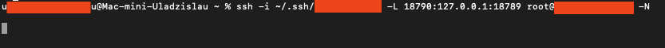

Now open your browser on your local machine:

```
http://localhost:18789
```

On first open you'll see the gateway connection screen. Paste your **gateway token** (printed at the end of the installer) and click **Connect**:

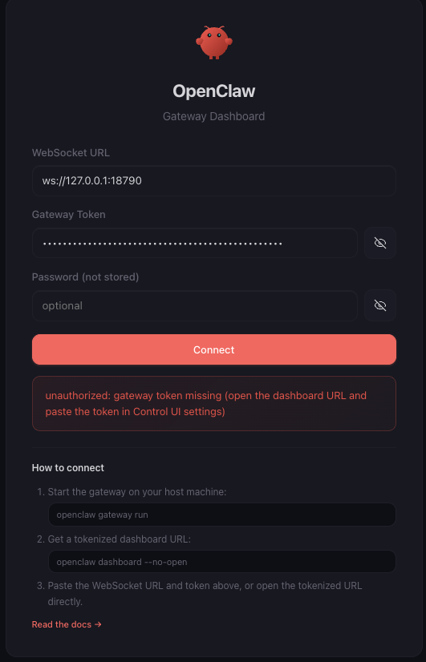

Once connected you'll see the Overview dashboard:

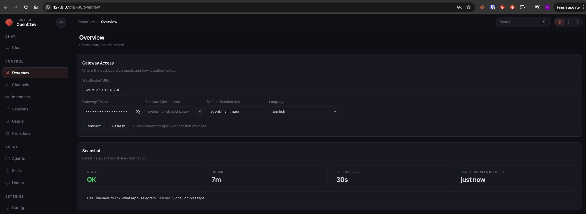

To stop the tunnel: press `Ctrl+C` in the terminal/PowerShell window (or close PuTTY).

---

## Non-interactive install

Pre-set environment variables to skip all prompts — useful for scripting or re-installs:

```bash
export RUNTIME_PROVIDER=openai          # openai | anthropic
export RUNTIME_AUTH_METHOD=api_key      # api_key | codex (openai) | oauth (anthropic)
export OPENAI_API_KEY=sk-...            # or ANTHROPIC_API_KEY
export TELEGRAM_BOT_TOKEN=123456:ABC...
export BIND_MODE=topic                  # topic | direct
export BIND_TELEGRAM_LINK=https://t.me/c/1234567890/2
export AUTO_CONFIRM=true
export NON_INTERACTIVE=true

bash <(curl -fsSL https://raw.githubusercontent.com/no-name-labs/openclaw-install-scripts/main/vps/digitalocean/install.sh)
```

---

## After install

- Send a message to your Telegram bot to verify it's responding.
- OpenClaw auto-starts on reboot via cron (added by the installer).
- Logs: `~/.openclaw/logs/gateway-run.log`

### Useful commands (run on the droplet)

```bash
openclaw gateway status     # check if the gateway is running
openclaw gateway restart    # restart the gateway
openclaw health --json      # full health probe
```

---

## Uninstall

```bash
openclaw gateway stop
sudo npm uninstall -g openclaw
rm -rf ~/.openclaw
crontab -l | grep -v "openclaw" | crontab -
```

---

## Screenshots

See the [`screenshots/`](screenshots/) folder for the full annotated walkthrough.
